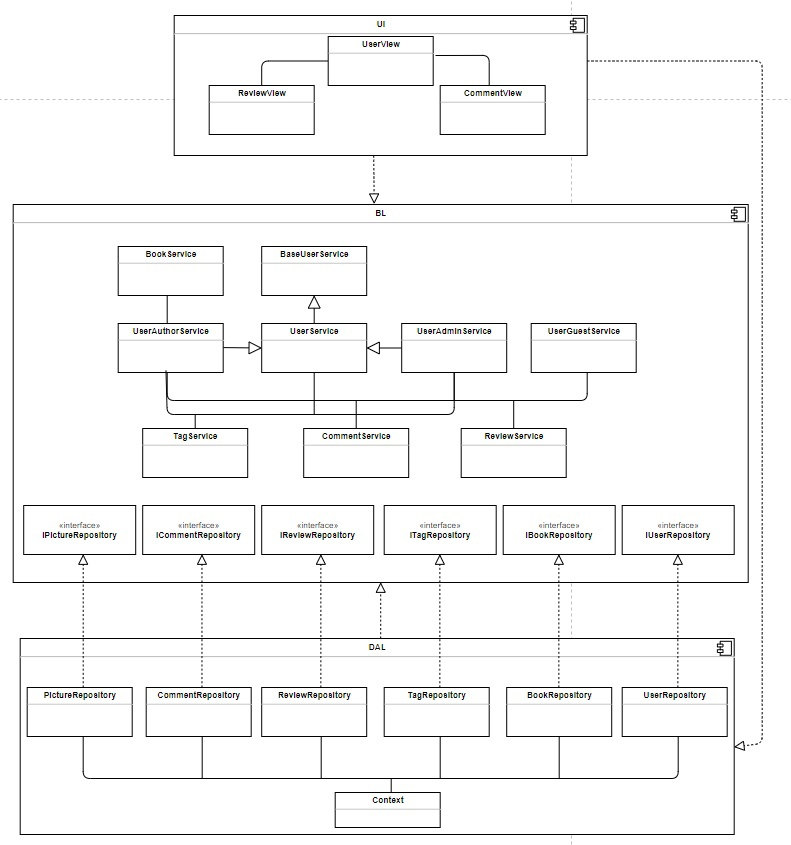
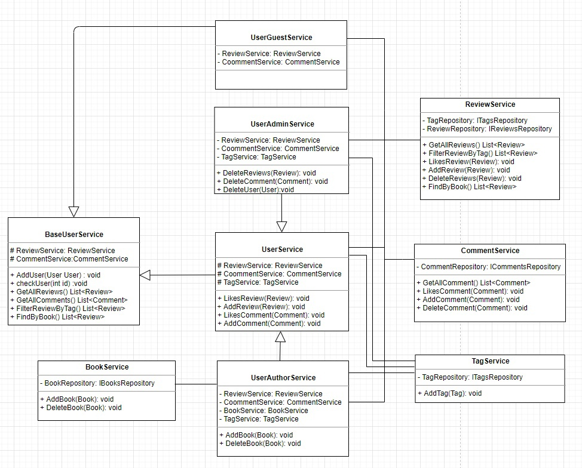
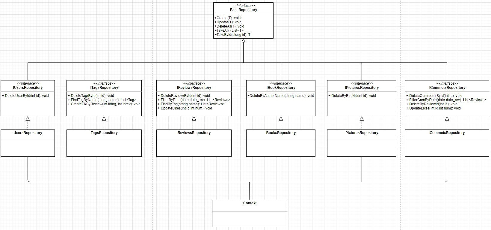
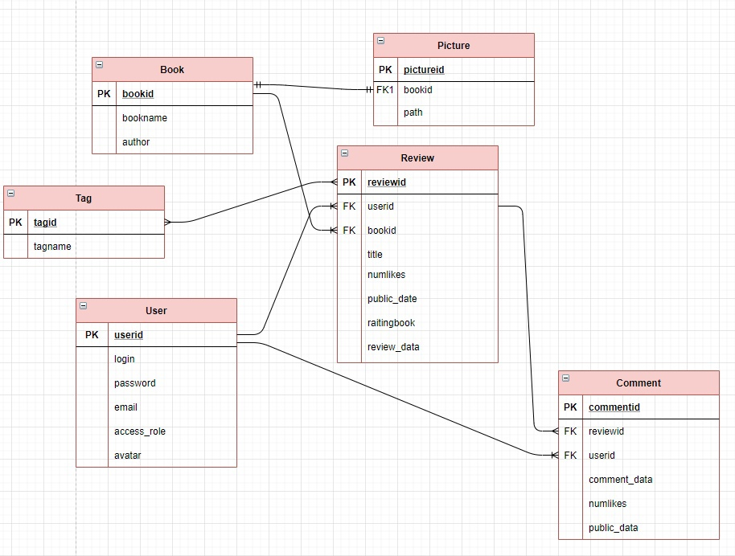
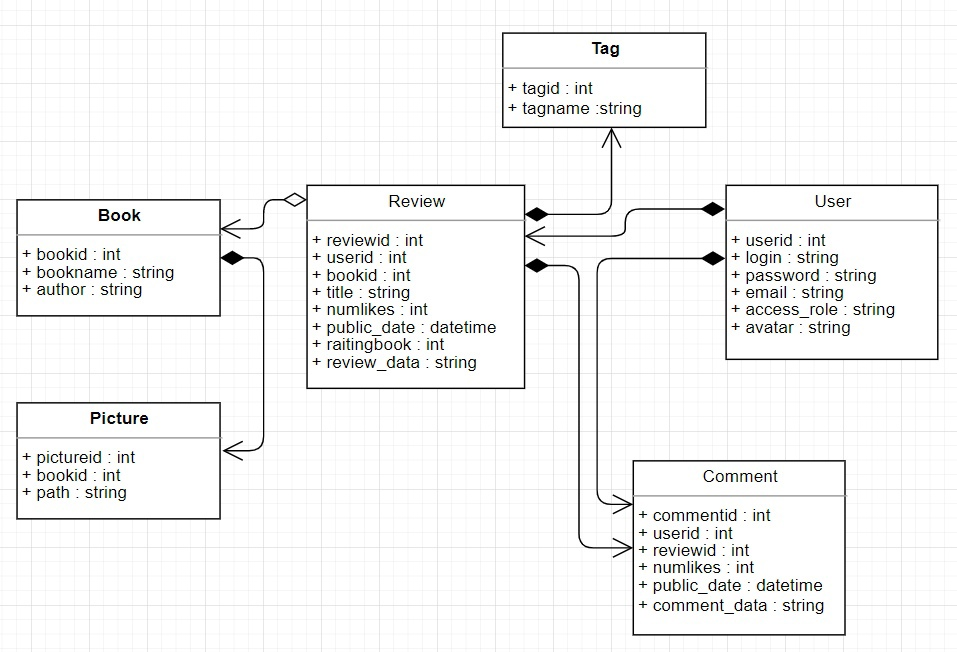

# Платформа для размещения рецензий на книги

## Краткое описание идеи проекта
Данная платформа обеспечивает возможность авторизации пользователей, создания собственных рецензий, их удаление и комментирование. Также пользователям может оценивать рецензии и комментарии к ним, просматривать рецензии, имеющие одинаковый тег.

## Краткое описание предметной области
В наше время книги все еще имеют большой интерес у людей. Книги используются и как возможность отдохнуть, погрузившись 
в какие-либо интересные истории, но также как источник знаний в разных сферах жизни человека. С каждым годом количество книг только увеличивается, и читатель теряется в выборе новой литературы.
Как правило при поиске новых книг читатель вынужден прочесть рецензии, чтобы понять понравится ли ему определенная книга. Поэтому было бы удобно иметь сервис, где одни пользователи выкладывали рецензии, а другие 
могли бы их прочесть и ускорить процесс выбора новой литературы.

## Краткий анализ аналогичных решений по 3 критериям
|    Название    |Комментирование и оценивание рецензий|Добавление новых книг авторами|Подборки книг|Рекомендации книг|
|:--------------:|:-----------------------------------:|:----------------------------:|:-----------:|:---------------:|
|readrate.ru     |                  +                  |              -               |     +       |       -         |
|livelib.ru      |                  +                  |              -               |     +       |       +         |
|bookmix         |                  +                  |              -               |     +       |       +         |
|Мое решение     |                  +                  |              +               |     -       |       -         |

## Краткое обоснование целесообразности и актуальности проекта
Актуальность разработки состоит в том, что с помощью такого сервиса человек сможет сэкономить время на подборе новых книг для себя,
выложить свое мнение о книгах и обсудить их путем комментирования рецензий. Также данный сервис имеет приемущество над аналогами, так как дает возможность развиваться малоизвестным авторам путем добавления ими своих книг для оценки пользователям.
## Use-Case - диаграмма

## ER-диаграмма сущностей

# Описание типа приложения и выбранного технологического стека
Стек: C#,PostgresSQL, CSS, HTML, JS.
Среда разработки VScode.

# Верхнеуровневое разбиение на компоненты (в следующих лабах сможете уточнить): на базовом уровне выделяем компонент доступа к данным, компонент бизнес-логики и компонент реализации UI.

# UML диаграммы классов для двух отдельных компонентов - компонента доступа к данным и компонента с бизнес-логикой

# Cущности базы данных

# Cущности системы

